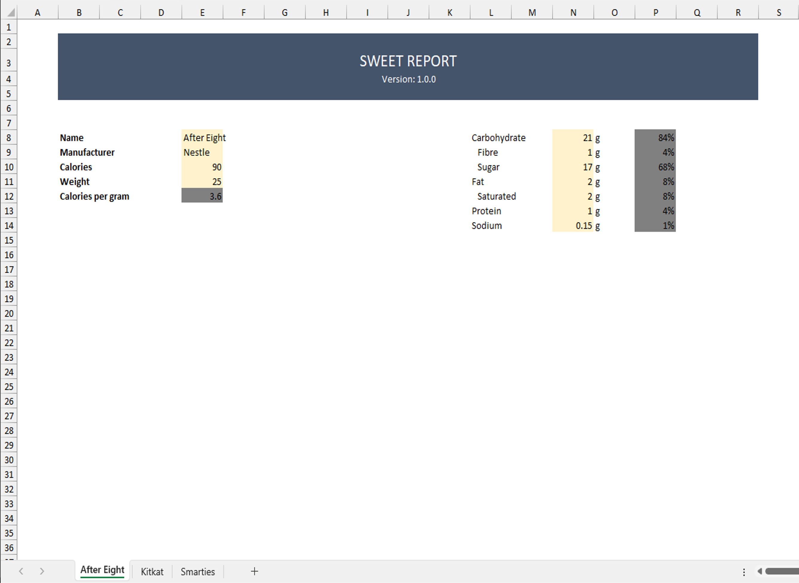
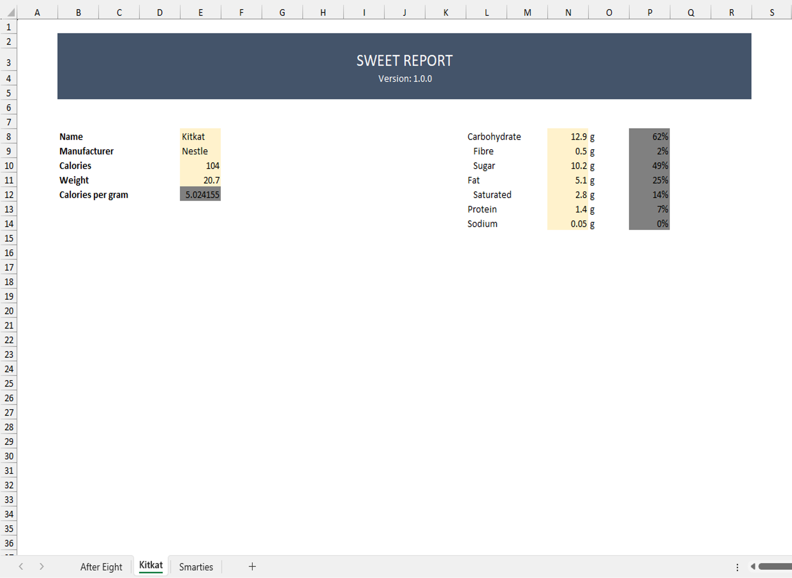
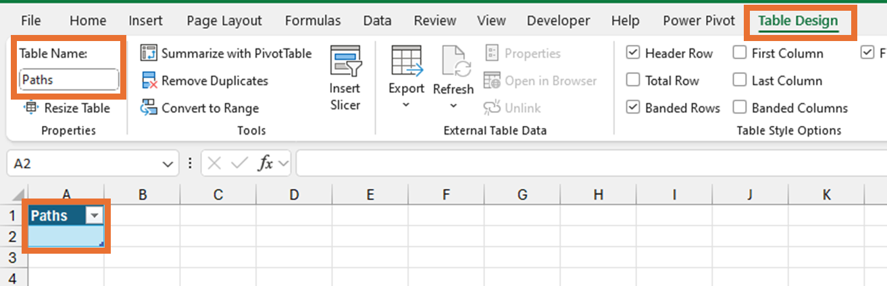
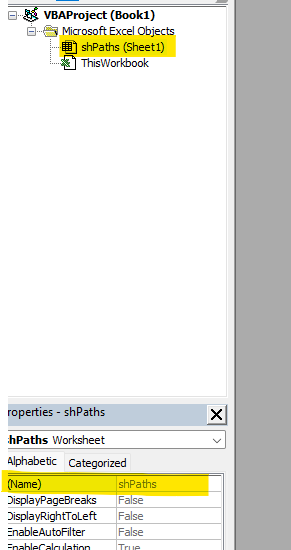
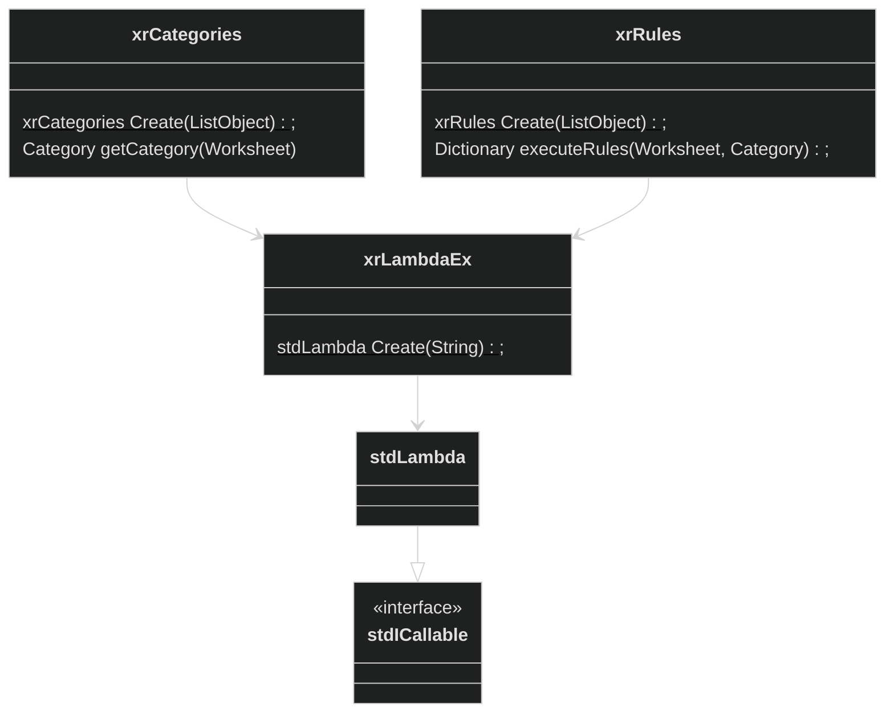
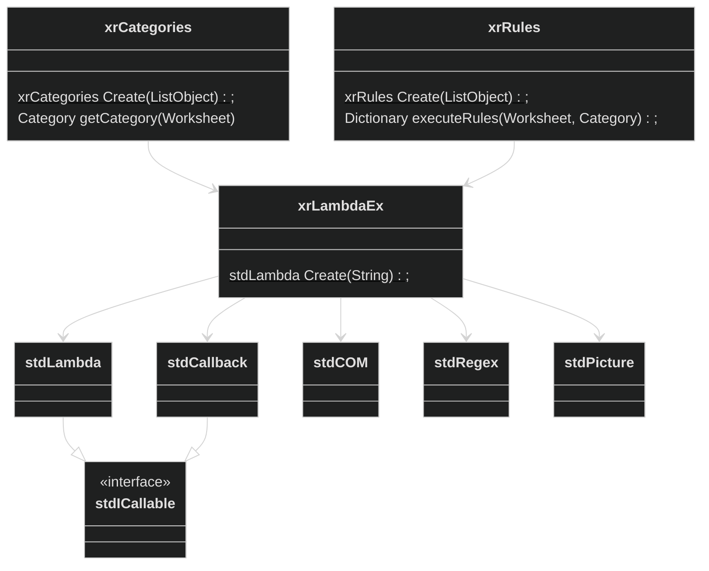
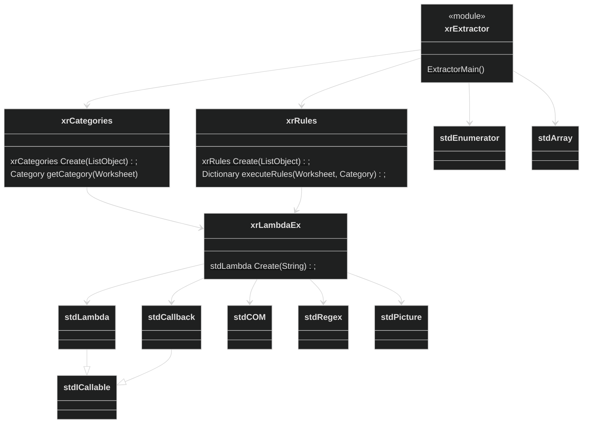

<!-- 
Demo doc:
https://raw.githubusercontent.com/evilz/vscode-reveal/master/samples/demo.md 
-->

<!-- .slide: data-transition="fade" data-background-transition="fade" -->

<section>
  <h2> Extracting Data from Spreadsheets</h2>
</section>

---

<section data-auto-animate>
  
</section>

<!-- In many professional settings, data is king. -->

---

<style>
    .growc {
        width: 0;
        transition: width;
    }
    .growc.visible {
        width: 30%;
    }
    .fragment > img {
      max-width:100%;
      max-height:100%;
    }
    
</style>

<section data-auto-animate>
  <div style="display:flex; justify-content:center; align-items:center;">
    <div class="no-margin" style="width: 30%">
      
    </div>
    <div class="fragment growc">
      
    </div>
    <div class="fragment growc">
      
    </div>
  </div>
</section>

<!-- And often, this data is scattered across multiple different tabs... -->

---

<style>
    .growc {
        width: 0;
        transition: width;
    }
    .growc.visible {
        width: 30%;
    }
    .fragment > img {
      max-width:95%;
      max-height:95%;
    }
    
</style>

<section>
  <div style="display:flex; justify-content:center; align-items:center;">
    <div class="no-margin" style="width: 30%">
      
    </div>
    <div class="fragment growc">
      
    </div>
    <div class="fragment growc">
      
    </div>
  </div>
</section>

<!-- of multiple different spreadsheets... -->

---

<section data-auto-animate>
  <div style="display:flex; justify-content:center; align-items:center;">
    
    
    
  </div>
</section>

---


<section data-auto-animate>
  <table>
    <tr height="300px">
      <td>
        <h4>File</h4>
      </td>
      <td>
        
      </td>
      <td>
        
      </td>
      <td>
        
      </td>
    </tr>
    <tr>
      <td>
        <h4>Version</h4>
      </td>
      <td style="text-align: center">
        v1
      </td>
      <td style="text-align: center">
        v1
      </td>
      <td style="text-align: center">
        v2
      </td>
    </tr>
  </table>
</section>

<!-- across multiple different versions... -->

---

<section data-transition="fade">
  
  
  
</section>

<!-- across many different directories... -->

---

# How?

<!-- The challenge? How can we write a tool which will be able to handle data extraction from all this data? -->

---


<!-- Many people's first go-to is PowerQuery -->

---

## Problem

<video src="./resources/powerquery-data.mp4" controls autoplay />

<!--
  You'll run into an issue because you'll need to handle this awful datastructure. I have seen some people clear this but it can be quite mind bending, and you'll have to do a different transformation for each version. Surely there's an easier way?!
-->

---

# Solution:
## VBA

<!-- The solution is using VBA -->

---

Initial solution



<!-- A naive solution might look like this. We create a paths table, and ensure it's name is set correctly -->

---



<!-- We also ensure the sheet itself is named `shPaths` -->

---

Initial solution

```vb
Dim results as Collection
Dim lo as ListObject: set lo = shPaths.ListObjects("Paths")

Dim vPaths: vPaths = lo.Range.Value
Dim i as long
For i = 2 to Ubound(vPaths,1)
  With Workbooks.open(vPaths(i,1))
    Dim sh as Worksheet
    For each sh in .worksheets
      With sh
        results.add Array(.[E8], .[E9], .[N8], .[N11])
      End with
    next
    .Close false
  End With
next
```

<!-- Then we add the following code -->

---

```vb {data-line-numbers="|1-3|5,6,16|7,14|8,9,13|10-12|15"}
Dim results as Collection
Dim lo as ListObject: set lo = shPaths.ListObjects("Paths")
Dim vPaths: vPaths = lo.Range.Value

Dim i as long
For i = 2 to Ubound(vPaths,1)
  With Workbooks.open(vPaths(i,1))
    Dim sh as Worksheet
    For each sh in .worksheets
      With sh
        results.add Array(.[E8], .[E9], .[N8], .[N11])
      End with
    next
  End With
  .Close false
next
```
<!-- We get the file paths from the recently created table. -->
<!-- We loop over each workbook path. -->
<!-- Open it. -->
<!-- Loop through each sheet. -->
<!-- And assign results to our array, before finally -->
<!-- closing the workbook. -->

<!-- This currently doesn't handle different versions of the workbook/sheet however, so...  -->

---

```vb {data-line-numbers="10|24-31|11-18"}
Dim results as Collection
Dim lo as ListObject: set lo = shPaths.ListObjects("Paths")
Dim vPaths: vPaths = lo.Range.Value

Dim i as long
For i = 2 to Ubound(vPaths,1)
  With Workbooks.open(vPaths(i,1))
    Dim sh as Worksheet
    For each sh in .worksheets
      Dim iVersion as Long: iVersion = getVersion(sh)
      With sh
        select case iVersion
          case 1
            results.add Array(.[E8], .[E9], .[E11]/.[E12], .[N8], .[N11])
          case 2
            results.add Array(.[E9], .[E10], .[E10]/.[E11], .[D17], .[D20])
        end select
      End With
    next
    .Close false
  End With
next

Function getVersion(ByVal sh as Worksheet) as Long
  select case true
    case [I4] = "Version: 1.0.0"
      getVersion = 1
    case [I4] = "Version: 1.1.0"
      getVersion = 2
  end select
End Function
```

<!-- We could obtain the version using a function named `getVersion` -->
<!-- Of which the definition would check certain cell references determining the version number -->
<!-- And then perform a different extraction algorithm based on the version number identified -->

---

# TODO:

<!-- 
Now this is a fairly trivial VBA script and with 29 lines of code it will likely suffice for most VBA users. There are still several issues:
* We aren't printing the data anywhere
* We currently don't handle corrupt workbooks
* We currently don't provide user feedback
* Users will be asked to update links
* Users will see a strobing as extracts run
but these can be added with relative ease.

-->

---

<h1 style="font-size: 1000%">🤔</h1>

<!-- But what about Excel users. Users who are intimidated by VBA? Can we turn this into a tool which even they can use? Many users are familiar with formulas, so it's not like there's a massive barrier. -->

---

<h1 style="font-size: 1000%">🖼️</h1>

<!-- If we give them a UI, can they do it for themselves? Finally wouldn't it be so much better to have a generic tool? It was for this reason I made a more generic version. TODO: this ok? -->

---

| Paths            | Processed |
|------------------|-----------|
| C:\...\test.xlsx | Yes       |
| C:\...\test.xlsx | No        |

<!-- First off we are going to create 2 new tables on top of our existing paths table -->

---

| Category | Processed               | Other rules ... |
|----------|-------------------------|-----------------|
| 1.0.0    | [I4] = "Version: 1.0.0" | ...             |
| 1.1.0    | [I4] = "Version: 1.1.0" | ...             |

<!-- One will be the categories table, in charge of categorising sheets processed. This is analagous to our "getVersion" function earlier. Users can supply as many rules as they like to distinguish sheets from each other -->

---

::: block {style="font-size: 30px"}
| Category | Name | Manufacturer | Cal per g   | Carb  | Fat   |
| -------- | -----| ------------ | ----------- | ----- | ----- |
| 1.0.0    | [E8] | [E9]         | [E11]/[E12] | [N8]  | [N11] |
| 1.1.0    | [E9] | [E10]        | [E10]/[E11] | [D17] | [D20] |
:::

<!-- And a rules table, which maps Category, to columns and how to extract the data -->

---

<!-- .slide: data-transition="fade" -->



<!-- We are going to offload the execution of the Rules and identification of Category, to the `LambdaEx` class, which in turn will offload most of its work to `stdVBA`'s stdLambda class. -->

---

<!-- .slide: data-transition="fade" -->



<!-- but in the process of extending the system, we will include a bunch of other classes too -->

---

<!-- .slide: data-transition="fade" -->



<!-- The main module performing the data extraction will be xrExtractor. Which will of course make heavy use of the xrCategories and xrRules, but will also make use of stdEnumerator for iterating through the paths table, and stdArray for collecting the results-->

---

```vb {style="font-size: 10px; line-height:12px;", data-line-numbers="|4-7,9|16-21|24,25,50|30,49|32,34,35,43|61-72|39|42|53,57"}
Public Sub ExtractorMain()
  Application.StatusBar = "Setting up..."
  
  Dim ePaths As stdEnumerator
  Set ePaths = stdEnumerator.CreateFromListObject(dataPaths.ListObjects("Paths"))
  Dim categories As xrCategories: Set categories = xrCategories.Create(dataCategories.ListObjects("Categories"))
  Dim rules As xrRules: Set rules = xrRules.Create(dataRules.ListObjects("Rules"))
  
  Dim results As stdArray: Set results = stdArray.Create()
  
  'Boot a new instance of the excel application
  'opening workbooks in a seperate instance ensures that the workbook isn't loaded on each loop cycle.
  'it will also ensure that we can set various performance increasing settings, allowing us to scan the
  'workbook as soon as possible. Finally we can prevent annoyances like Asking to update links.
  'note we intentionally don't set this app to visible.
  Dim xlApp As Excel.Application: Set xlApp = New Excel.Application
  xlApp.AskToUpdateLinks = False
  xlApp.ScreenUpdating = False
  xlApp.AutomationSecurity = msoAutomationSecurityForceDisable
  xlApp.EnableEvents = False
  xlApp.DisplayAlerts = False
  
  'Loop over each path in the supplied paths table
  Dim oPath, i As Long: i = 0
  For Each oPath In ePaths
    'Increment progress counter
    i = i + 1
    
    'Only extract if Processed <> Yes
    If oPath("Processed") <> "Yes" Then
      'Open workbook in hidden instance
      Dim wb As Workbook: Set wb = forceOpenWorkbook(oPath("Path"), xlApp)
      
      Dim ws As Worksheet
      For Each ws In wb.Worksheets
        Application.StatusBar = "Processing workbook " & i & "/" & ePaths.length & " Worksheet: " & ws.name
        
        'Get category from sheet data
        Dim sCategory As String: sCategory = categories.getCategory(ws)
        
        'Perform extraction
        If sCategory <> "" Then Call results.Push(rules.executeRules(ws, sCategory))
      Next
      
      wb.Close SaveChanges:=False
      
      'Update row
      Call setRowCell(oPath, "Processed", "Yes")
    End If
  Next
  
  'Close hidden app instance
  xlApp.Quit
  
  
  Application.StatusBar = "Exporting results..."
  Call exportResults(dataOutput, "Output", results)
  Application.StatusBar = Empty
End Sub

Private Function forceOpenWorkbook(ByVal sPath As String, Optional ByVal xlApp As Excel.Application = Nothing) As Workbook
  If xlApp Is Nothing Then Set xlApp = Application
  On Error GoTo TryRepair
  Set forceOpenWorkbook = xlApp.Workbooks.Open(sPath)
  Exit Function
TryRepair:
  On Error GoTo ErrorOccurred
  Set forceOpenWorkbook = xlApp.Workbooks.Open(sPath, CorruptLoad:=XlCorruptLoad.xlRepairFile)
  Exit Function
ErrorOccurred:
  Set forceOpenWorkbook = Nothing
End Function
```

<!-- 
So here we have the code for xrExtractor's main sub routine.
* We first start by creating wrappers around the Paths, Categories, Rules tables, and create our Results array.
* NB. The paths object is using a handy function in stdVBA's stdEnumerator class to obtain an enumerator of Dictionary objects.
* Next we create a new application instance. This allows us to disable various alerts, macros, etc. which might slow down the processing of the workbooks.
* Next we loop over all paths
* Check if the path hasn't been processed yet
* If not it will open the workbook and start iterating over the worksheets.
* Using forceOpenWorkbook ensures we can handle corrupt workbooks too.
* Next, we obtain the category of the sheet
* and if that category is identified, we'll run the extraction rules and add them to our results.
* Finally after all paths have been processed we'll export all results to the workbook and close the newly created application.
-->

---

```vb {style="font-size: 10px; line-height:12px;", data-line-numbers="|4,5"}
'CONSTRUCTOR
Private categories As stdArray
Public Function Create(ByVal lo As ListObject) As xrCategories
  Set Create = New xrCategories
  Call Create.protInit(lo)
End Function
Friend Sub protInit(lo As ListObject)
  Set categories = stdArray.Create()
  
  Dim vCat As Object
  For Each vCat In stdEnumerator.CreateFromListObject(lo)
    'Create a new category object, to be used by getCategory
    Dim oNewCategory As Object
    Set oNewCategory = CreateObject("Scripting.Dictionary")
    oNewCategory("Name") = vCat("Category")
     
    'Obtain conditions array, which is an array of lambdas, which can each be used to determine whether a targetSheet matches a category
    Dim conditions As stdArray: Set conditions = stdArray.CreateFromArray(vCat.items())
    Call conditions.Shift 'remove first element
    Set conditions = conditions.Filter(stdLambda.Create("not isObject($1)")) 'remove standard additions
    
    Set oNewCategory("Conditions") = conditions.Map(stdCallback.CreateFromObjectMethod(xrLambdaEx, "Create"))
    
    'Bind results to array categories global array
    categories.Push oNewCategory
  Next
End Sub

'Obtains a category from a given worksheet
'@param {ByVal Worksheet} Worksheet to identify category within. (VIDEO NOTE: `ByVal` is important here as it crashes without it, due to a VBA bug)
'@returns {String} - "" if no category found, else one of the categories listed in the primal list object
Public Function getCategory(ByVal targetSheet As Worksheet) As String
  For Each Category In categories
    Call Category("Conditions").ForEach(stdLambda.Create("$2.bindGlobal(""targetSheet"",$1)").Bind(targetSheet))
    If Category("Conditions").Reduce(stdLambda.Create("$1 and $2.Run()"), True) Then
      getCategory = Category("Name")
      Exit Function
    End If
  Next
  getCategory = ""
End Function
```

---


